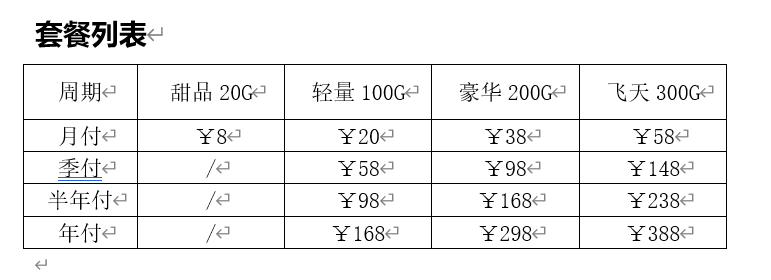

老牌机场推荐：朱雀云
朱雀云官网
长期有效跳转地址：16168.top
目前地址：https://zq1.163163.one/
QQ群：635354515
电脑群：https://t.me/+BWipMUI450I1NTA1
购买订阅后，进群联系管理员送流量

简介
朱雀云，是一家创建于2023年的翻墙机场，已稳定运营1年，旨在为中国大陆用户提供国际互联网的访问服务。
朱雀云机场为全中转机场，最大限度保证了低延迟的连接性能。
朱雀云还采用了Reality、Hysteria2等最新协议，可直接拉满带宽，并具有极强的穿墙能力与私密性，避免使用过程中被墙。与此同时，朱雀云还拥有Vmess、SSR、Trojan等主流协议，供用户根据自身需求及客户端，自由选择。
此外，朱雀云采用了CN2GIA、BGP等优质线路，并使用了搬瓦工、DMIT、HKT、AKILE等优质服务器作为落地，为用户提供优质的网络服务。
朱雀云正在不断更新探索新兴稳定协议节点，致力于给用户提供最好的服务和体验。

节点国家包括：美国、香港、日本、新加坡、台湾、俄罗斯、荷兰，并在持续增加热门及冷门地区节点，为用户提供更多丰富的互联网内容。

机场特色
	流媒体全解锁，奈飞、动画疯、HBO自由观影
	主流AI全解锁，ChatGPT、Copilot、Gemini、Midjourney、RunwayGen2等AI自由访问，纵情体验AI乐趣，提升生产力
	全节点家宽，没有商业节点限制
	万兆带宽，秒开4K不卡顿
	最新穿墙协议，防墙防封，带宽拉满
	顶尖技术团队，保证线路稳定与速度优化
	运营团队常驻国外，保证稳定运营
	支持支付宝与微信支付
	套餐多样，低至3毛钱/天
	无任何套路，敬请放心购买
安全·私密·高速·稳定
永不掉线的翻墙机场

收藏本站，永不失联，并随时获取朱雀云最新的优惠活动

